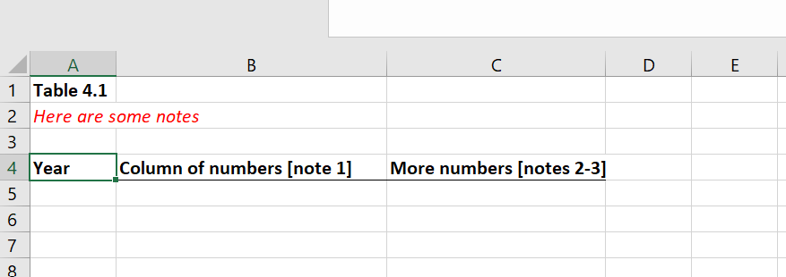
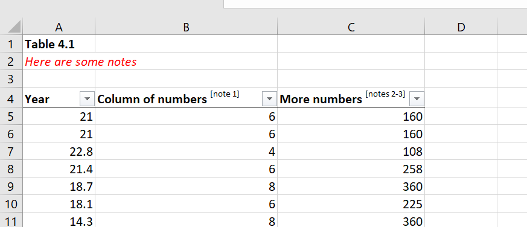

# tableformatr

R package add-on for openxlsx, making it easy to write table-formatted data into Excel using a template file which includes titles, table headers and footnotes. This is particularly useful when you want to create an accessible table with column headers that you don't want to hard code (due to changing footnotes or name complexity) and want to set in the template instead.

## Installation

Install the development version of the package from GitHub:

```
install.packages("devtools")
devtools::install_github("department-for-transport-public/tableformatr")
```

## Using the package

### Creating a template

This package is designed to allow you to read in a template which includes a table header row. This template can contain a title tab, notes, and as many data tabs as required. Individual sheets can contain formatted titles and a single header row of a table, but should not contain any existing data or multiple header rows. You shouldn't format the template as a table in any way, this will be done as part of the writing process.

An example of a template:



To read in your template, use the openxlsx function loadWorkbook:

```
template <- loadWorkbook("your_template_path.xlsx") 
```

### Writing data out as a table

The main function of this package `writeDataTableTemplate()` allows you to write data out as an Excel table format, to create accessible tables. It will use the table header row in your template as the header for the finalised table.

```
writeDataTableTemplate(wb = your template wb object,
                        sheet = sheet number or name you're writing to,
                        x = your data,
                        startRow = the Excel row number of the table header row,
                        tableName = name of the formatted table
                        )
```

The template workbook object, sheet number and dataset you want to write out can be passed to the function as arguments. You should also specify the startRow of the table; this is the existing table header row included in your template (e.g. row 4 in the example). You can also specify a tableName in the function, which makes it easier for users to identify tables using assistive technology. If you don't specify a name, it will default to Table1, Table2, etc notation.

### Copying column formatting to new columns

For situations where you may already have accessible tables and which you want to update with a new column of data.

`copyColumnStyles()` allows you to copy formatting from an existing column into one or more new columns, for a pre-defined range of rows. This can be used to update your accessible tables in the following way:

* Use `openxlsx::read.xlsx()` to read in the data currently in your table, including the headers. 
* Use `openxlsx::removeTable()` to remove the markup of the table in the workbook, while retaining formatting. 
* Write your updated data into the template using `openxlsx::writeDataTable()`.
* Use `copyColumnStyles()` to copy the cell formatting to your new column in the table. This ensures that any bolding, italics, fonts, font sizes etc. will be in the new column.

```
copyColumnStyles(wb = your template wb object,
                  sheet = sheet name you're writing to,
                  colFrom = the Excel column number to copy the cell styles from,
                  colTo = the Excel column number(s) to copy the cell styles to,
                  rows = the Excel row numbers to apply the function to
                )
```


### Formatting footnote notations

The package also has a function (`superscriptNotes()`) to format any accessible footnote notations into superscript. These notes should be in the structure [note X] to be recognised by the function, and it is only necessary to run this once for a whole workbook once the data is written, regardless of number of sheets.

```
superscriptNotes(wb = your template wb object)
```

### Adding a title to your workbook

Excel workbooks can have a title added as part of their metadata; this is visible to screen readers and helps people using them to understand the contents of your file.

To add a title to your workbook, or to replace the existing title in a workbook, you can use the function `addTitle()`, specifying the workbook in question and passing the title as a string. By default, the function won't overwrite an existing title, but you can change this behaviour by setting the `overwrite` argument to TRUE.

```
addTitle(wb = your template wb object,
        title = "Title of your workbook")
```


### Outputting the finished tables

To write out the finished and formatted Excel file, you can use the openxlsx function `saveWorkbook()`, passing it the name of your workbook object.

Example of appearance of finished workbook after data writing and formatting:



